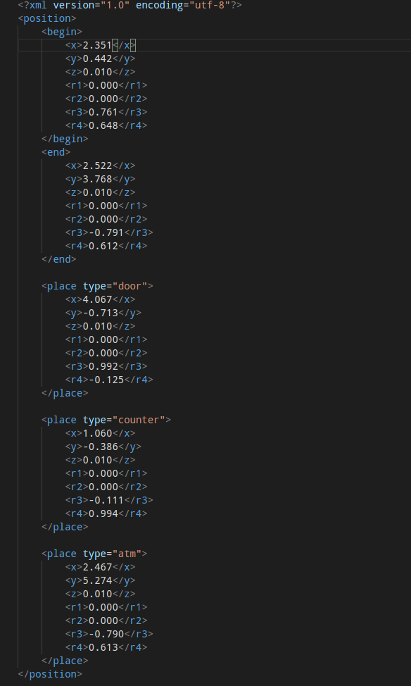

### 下位机程序使用说明 create by siwanghu v1.0  
# ROS启动流程  
> **启动ROS** roscore  
>  
> **启动Turtlebot底盘** roslaunch turtlebot_bringup minimal.launch 
>   
> **载入地图** roslaunch turtlebot_navigation amcl_demo.launch map_file:=/tmp/my_map.yaml  
>  
> **打开RVIZ设置底盘初始位置** roslaunch turtlebot_rviz_launchers view_navigation.launch --screen  
# 下位机程序启动流程  
> **启动巡航脚本** python cruise.py  
>  
> **启动导航脚本** python navigator.py  
>  
> **启动图形化测试界面** python exec.py  
# 上位机与下位机命令交换格式  
> *巡航指令*  
>  
> run &nbsp;&nbsp;&nbsp;&nbsp; **底盘开始巡航**  
> stop&nbsp;&nbsp;&nbsp;&nbsp;**底盘停止巡航**  
>  
> *导航指令*  
> door&nbsp;&nbsp;&nbsp;&nbsp;&nbsp;&nbsp;&nbsp;**导航到出口**  
> atm&nbsp;&nbsp;&nbsp;&nbsp;&nbsp;&nbsp;&nbsp;&nbsp;**导航到ATM机**  
> counter&nbsp;&nbsp;&nbsp;&nbsp;**导航到柜台**  
>  
> ## 注意  
> *导航指令在position.xml文件中定义，可以自定义添加或删除*  
>   
> **程序初始化时可以发送导航指令或巡航指令给底盘,但是如果底盘处于巡航状态下时必须先发送stop指令停止巡航，之后才能发送导航指令**  
# XML位置文件格式
> 